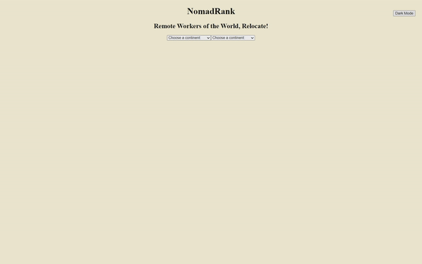
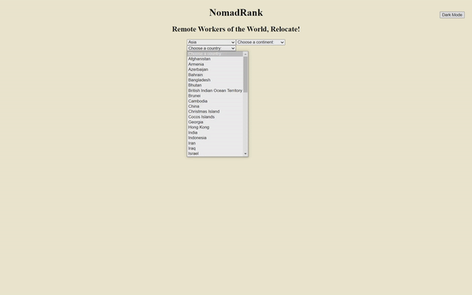
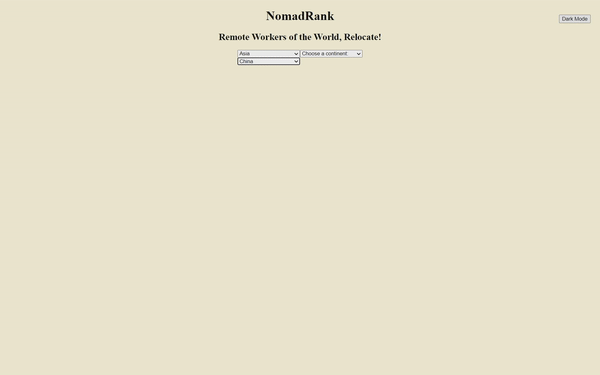
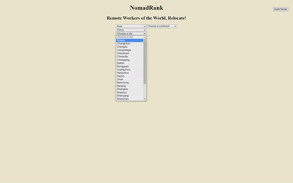
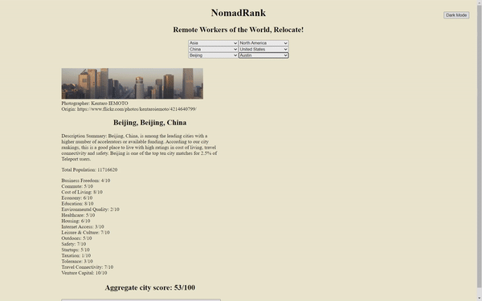
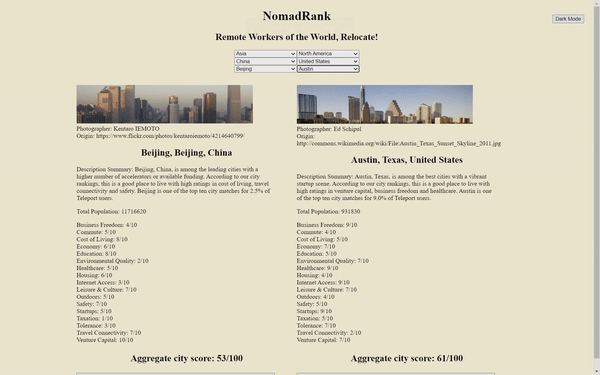
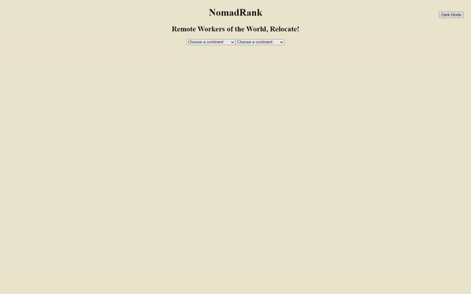

<h1 align="center">Welcome to NomadList 👋</h1>

# An intuitive city search and scoring app

> Satisfy your wanderlust, find a global destination, and embark on your next digital nomad journey!

## Project Philosophy

This project is motivated by the ongoing, pandemic-accelerated trend within the US workforce to engage in and normalize remote work opportunities. Thus, NomadList directly targets remote-workers seeking a change of scenery, aspiring digital nomads seeking their first big move, veteran expats mulling over a new location to set up shop, and anyone else yearning to live or travel elsewhere.

## General User Experience

The world is a vast and incredibly diverse place. This app makes it simple for users to search for cities from any continent or country and subsequently view a concise summary of city facts, a list of quality of life scores, and an overall aggregate city score for the selected city. Users can also select a second city to view alongside their first city search choice, which allows for a more comparative viewing of city quality of life scores that better aids users in their city decision-making.

## Specific Features

- Can search through hundreds of global destinations [teleport api](https://developers.teleport.org/)
- Can specify which continent and country you are interested in finding a city
- Can view individuaized profiles of each city, replete with an itemized and aggregate scoring of the city based on different quality of life criteria
- Can view two city profiles at the same time to enable easier comparison and highlight the contrast between different cities' quality of life scores

## How to Use

1. ***Start the search by selecting a continent from the dropdown menu labeled 'Choose a continent:'***

> 

2. ***Continue the search by selecting from a newly generated list of countries labeled 'Choose a country:'***

> 

3. ***Finish the search by selecting a city from the newly generated list of cities labeled 'Choose a city:'***

> 

4. ***View a newly created city profile card that displays a snapshot image of the city, full city name, summary description of the city, city population, as well as a full itemized listing of different quality of life scores and an overall city score ***

> 

5. ***Repeat the search process to select a second city and view its city profile alongside the first selection***

> 

6. ***Click the 'Reset Selection' button beneath each card to reset your choice and make a new selection***

> 

7. ***(Optional) Click the 'Dark Mode' button to toggle between dark and light modes***

> 

## Author

👤 **Joshua Mayhew**

* Website: https://github.com/jmayheww
* Github: [@jmayheww](https://github.com/jmayheww)
* LinkedIn: [@https:\/\/www.linkedin.com\/in\/joshua-mayhew-28883a89\/](https://linkedin.com/in/https:\/\/www.linkedin.com\/in\/joshua-mayhew-28883a89\/)

